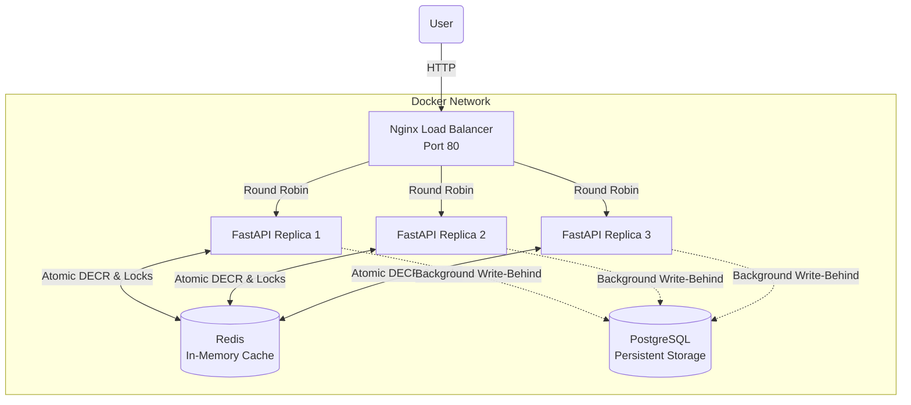
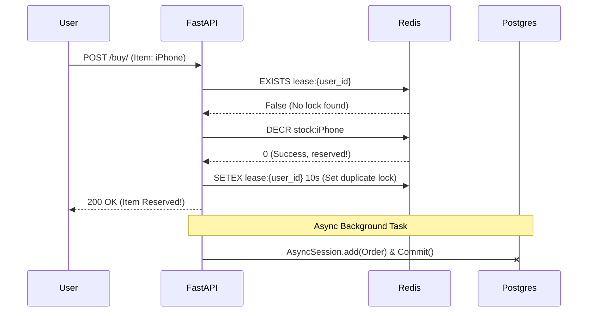

# Flash Sale Engine


A high-concurrency, horizontally scaled flash-sale backend engineered to handle extreme traffic bursts. Built with **FastAPI**, **Redis**, and **PostgreSQL**, this engine uses atomic Redis operations to completely eliminate overselling and race conditions without creating database bottlenecks.

## Architecture & System Topology

The engine is horizontally scaled behind an **Nginx** reverse proxy, distributing traffic across multiple FastAPI replicas. 



### The Flash Sale Flow (Write-Behind Pattern)

To achieve maximum throughput, the engine NEVER waits for PostgreSQL during a purchase. It relies entirely on Redis for instantaneous validation, and saves the order to PostgreSQL in the background.



## Core Features

- **Horizontal Scaling** — Traffic is distributed across 3 independent API replicas via Nginx.
- **Atomic Stock Management** — Redis `DECR` prevents race conditions on stock counts across thousands of concurrent requests.
- **Duplicate-Purchase Lock** — Redis `SETEX` lease (`lease:{user_id}`) strictly blocks a user from double-submitting a purchase while one is in flight.
- **Rollback on Partial Failure** — If any item in a multi-item cart is out of stock, previously decremented stock for that order is instantly restored.
- **Anti-Bot Challenge** — Requires users to solve a math challenge (`/buy/challenge`) before purchasing, preventing script spam.
- **Rate Limiting** — Strict rate limiters on login and purchase endpoints to drop malicious traffic at the gate.
- **Dual JWT Authentication** — Stateless auth featuring short-lived access tokens and 7-day refresh tokens. CPU-heavy `bcrypt` hashing is offloaded to a thread pool (`asyncio.to_thread`).
- **Database Migrations** — Alembic is configured for programmatic migrations on startup.

## Tech Stack

| Layer | Technologies |
| :--- | :--- |
| **API Framework** | FastAPI, Pydantic, Uvicorn |
| **Concurrency / Cache** | Redis |
| **Database** | PostgreSQL, SQLAlchemy (async), asyncpg, Alembic |
| **Security** | PyJWT, bcrypt |
| **Load Balancing** | Nginx |
| **Containerization** | Docker, Docker Compose |
| **Load Testing** | Locust |

## Setup & Run

### 1. Clone and Configure

```bash
git clone https://github.com/naina-sriv/flash-sale-engine.git
cd flash-sale-engine
```

Create a `.env` file in the root directory:
```
SECRET_KEY=your-super-secret-key
ALGORITHM=HS256
ACCESS_TOKEN_EXPIRE_MINUTES=30
REFRESH_TOKEN_EXPIRE_DAYS=7
```

### 2. Run the Stack

Spin up the entire architecture (Nginx, 3x API replicas, Postgres, Redis):
```bash
docker compose up --build -d
```

### 3. Load Testing

A Locust load test is included to verify the concurrency model. Test the Nginx load balancer natively:

```bash
python -m locust -f stress_locustfile.py --headless -u 1000 -r 200 --run-time 30s -H http://localhost
```

## API Endpoints

| Endpoint | Method | Auth | Description |
| :--- | :--- | :--- | :--- |
| `/auth/signup` | POST | — | Registers a new user |
| `/auth/login` | POST | — | Returns Access & Refresh JWTs |
| `/auth/refresh` | POST | — | Generates a new access token |
| `/auth/forgot-password`| POST | — | Generates a secure reset token via Redis |
| `/auth/reset-password` | POST | — | Updates the user's password |
| `/buy/challenge` | GET | JWT | Returns a math challenge question |
| `/buy/` | POST | JWT | Submits answer and reserves item(s) |
| `/buy/stress` | POST | — | Raw performance testing endpoint |
| `/stock/` | GET | — | Returns current Redis stock counts |
| `/stock/set` | POST | JWT+Admin | Sets stock manually |
| `/admin/flash/add` | POST | JWT+Admin | Adds an item to the flash sale |
| `/admin/flash/remove`| POST | JWT+Admin | Removes an item from the flash sale |
| `/admin/flash/list` | GET | JWT+Admin | Lists current flash-sale items |

## Inspiration

This project was heavily inspired by the infamous **Savana 1 Rupee Sale**, where massive influxes of traffic attempting to purchase highly discounted items simultaneously crashed servers and exposed the flaws in traditional e-commerce architectures. 

When thousands of users try to buy a 1-rupee item at the exact same millisecond, traditional databases suffer from massive I/O bottlenecks and row-lock contention. By shifting the atomic locking mechanisms away from standard relational database constraints and into ultra-fast, single-threaded Redis primitives, this engine demonstrates how to architect a backend that thrives under extreme traffic spikes rather than collapsing under them.